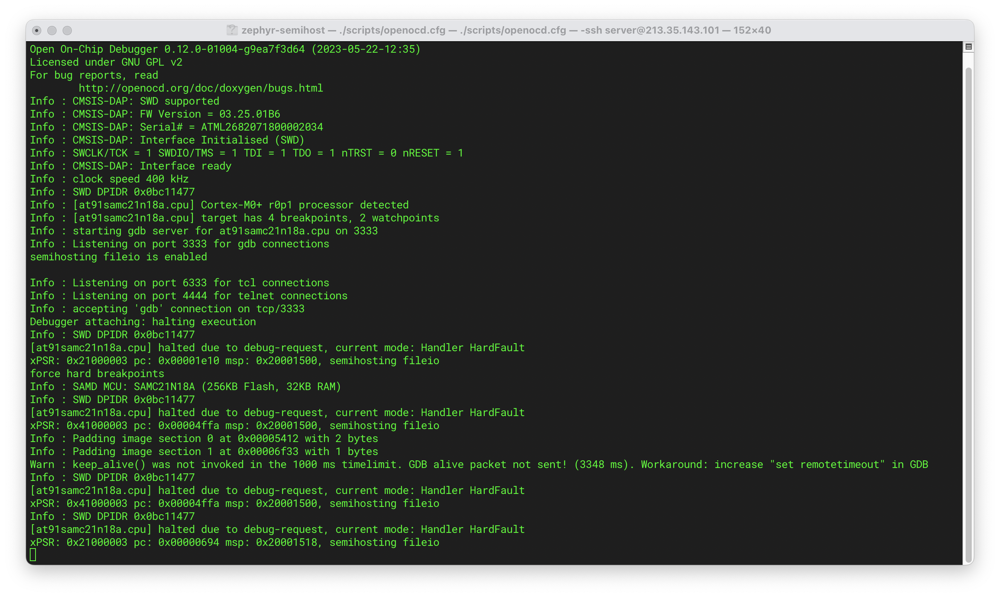
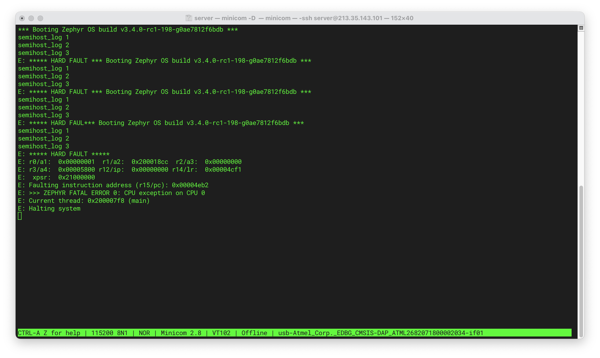
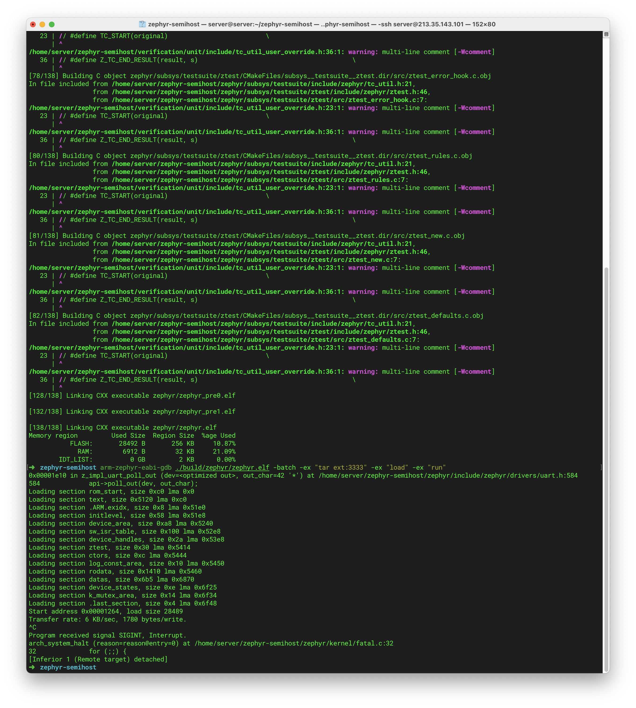
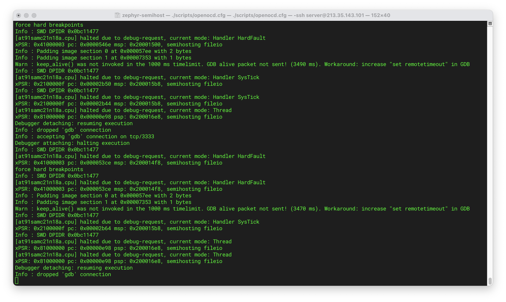
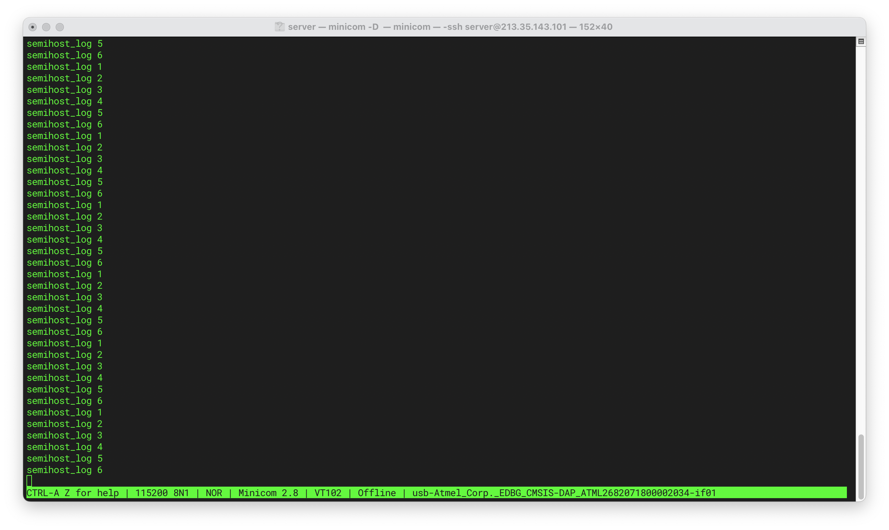
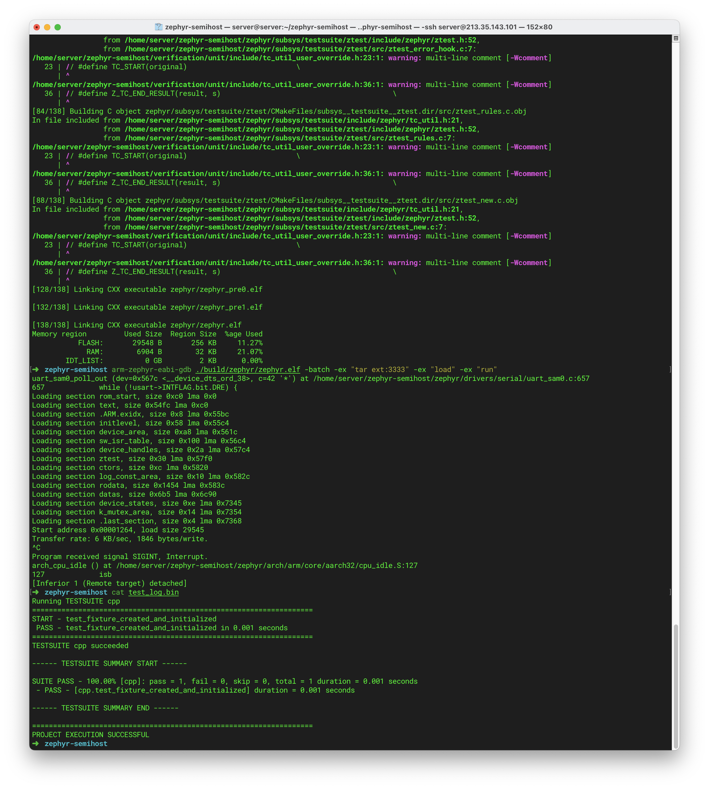

# Zephyr Semihost bug

**Describe the bug**
 I'm trying to replace `printk` with semihosting (for testing), as our (deeply) embedded system does not have a serial port.

 During development, I've stumbled upon the following interesting observation:

*`semihost_open` does not work/causes `HARD FAULT`, unless I introduce some small delay before calling `semihost_exec`.*

So it would look like this:

```cpp
// zephyr/arch/common/semihost.c
long semihost_open(const char *path, long mode)
{
	struct semihost_open_args args = {.path = path, .mode = mode, .path_len = strlen(path)};

	k_sleep(K_MSEC(1)); // THIS IS ADDED!
	return semihost_exec(SEMIHOST_OPEN, &args);
}
```

If I don't do this, it results in a Zephyr hard fault when I try to run the test.

- My target platform: `atsamc21n_xpro`

**To Reproduce**

I have set up a repository, for anyone to try to reproduce this issue:

```bash
git clone https://github.com/maksimdrachov/zephyr-semihost
cd zephyr-semihost
git clone git@github.com:zephyrproject-rtos/zephyr.git
cd zephyr 
git checkout c22c4fd49f6671079cd9df19d4c22678294be87d 
cd ..
west update
```

(This will work with `atsamc21n_xpro`, if you want to test with a different board: don't forget to update `scripts/openocd.cfg`)

Terminal window #1:

```bash
cd ~/zephyr-semihost
./scripts/openocd.cfg
```

Terminal window #2:

(On the dev board I'm using there is a serial port, this won't be the case on the final product however.)

```bash
minicom -D /dev/serial/by-id/usb-Atmel_Corp._EDBG_CMSIS-DAP_ATML2682071800002034-if01
```

Terminal window #3:

```bash
cd ~/zephyr-semihost
west build -b atsamc21n_xpro ./verification/unit
arm-zephyr-eabi-gdb ./build/zephyr/zephyr.elf -batch -ex "tar ext:3333" -ex "load" -ex "run"
```

Interestingly, it works for the specific commit (c22c4fd49f) I'm using, I tried doing the same with Zephyr on the latest commit ([Zephyr v3.4.0-rc2](https://github.com/zephyrproject-rtos/zephyr/commit/2ad1a24fd60d0df8cb45fb6ed6acf7b0d3820754)) and got the same `HARD FAULT` error.

## Result without hotfix

*Terminal window #1*



*Terminal window #2*



*Terminal window #3*



## Result with hotfix

*Terminal window #1*



*Terminal window #2*



*Terminal window #3*



**Expected behavior**
`semihost_open` should not require an additional delay when being called.

**Impact**
So far I've found a workaround, however it is probably something that would have to be addressed since it might be pointing at some serious underlying issues.

**Environment (please complete the following information):**
 - OS: Linux (Ubuntu)
 - Toolchain: zephyr-sdk-0.16.1
 - Commit SHA or Version used: c22c4fd49f (Zephyr, with one change documented above)


